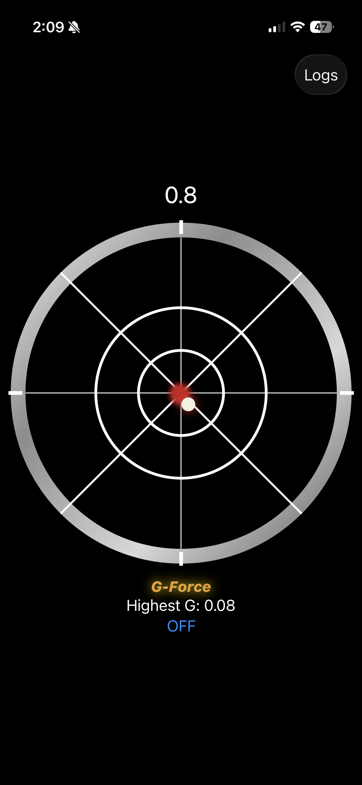
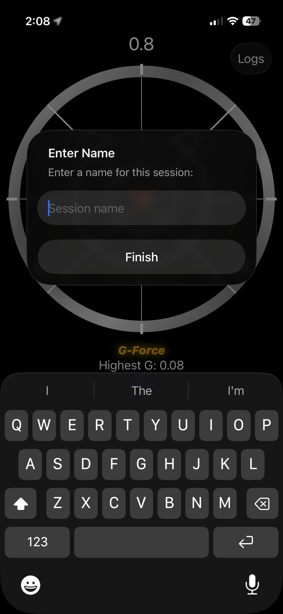
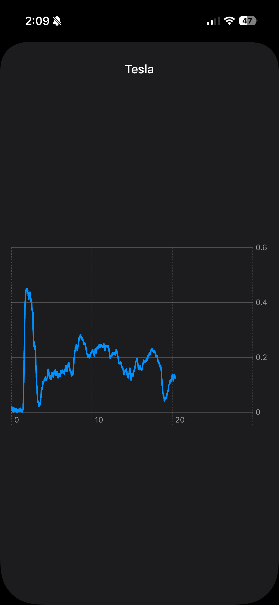

# G-Force Gauge

An iOS app that displays live G-force data from the phone's accelerometer, styled after an AMG-style instrument cluster gauge so I can role play driving an AMG in my Kia:)

  
  
  

## What it does
The app reads live acceleration data from CoreMotion and drives a reticle around a gauge face in real time showing direction and magnitude of G-force as you drive, brake, or turn. It also tracks the highest G-force recorded during a session.

## Before vs. After Filtering
Raw accelerometer data is noisy. Simple things such as road vibration and minor car jitter caused the reticle to shake constantly, even during smooth, steady driving. Adding a simple filtering/averaging pass on the incoming CoreMotion values smoothed this out substantially, without introducing noticeable lag.

📹 See `FilterComparison.mp4` for a side-by-side of the reticle before and after filtering.

## Architecture

The app follows a strict one-directional data flow:
Data only flows upwards from coreMotion -> ViewModel -> View. My first app made the mistake of having the view reach up and down forming connections to unnecessary information. That eventually became spaghetti code grinding my gym app to a halt.
Gladly I learned a cleaner architecture and built a more maintainable app. 

## What I Learned

- **CoreMotion** — reading live device motion data, and understanding it as a push-based system: sensor updates drive the entire app's behavior, rather than the UI polling for changes.

- **Signal filtering** — a simple averaging/smoothing pass to cut sensor noise without adding real lag, and the tradeoff between responsiveness and smoothness.

- **Clean app architecture** — enforcing a one-way data flow (motion → model → view) kept the codebase simple to reason about, even as features (tail trail, gauge styling) were added on top.

- **UI from basic building blocks** — the gauge ring, crosshair, and reticle trail all come from simple `Circle`, `Rectangle`, and `ForEach` usage, no third-party libraries. The trail effect in particular came from a fixed-size array of past positions, redrawn each time new data arrives.

- **Basic concurrency** — my first real attempt at async/await. The logging loop is a Task that polls the current G-force and suspends for a few milliseconds with Task.sleep, appending data points until the session is stopped. It's still a little buggy on some edge cases, but it works for normal use, and it was a good first pass at understanding how to suspend and resume an operation while allowing UI to update.

- **SwiftData** — used again here (already knew it from a previous app) to persist session logs across launches.
  
- **Swift Charts** — new to me. Used a Chart with a LineMark to plot a saved session's G-force against time.

*My second iOS app*
